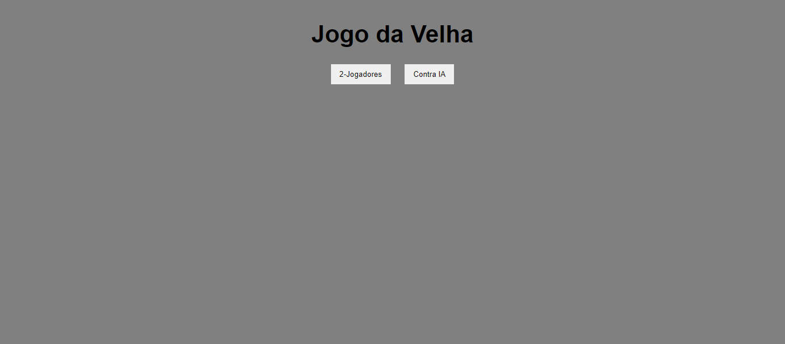
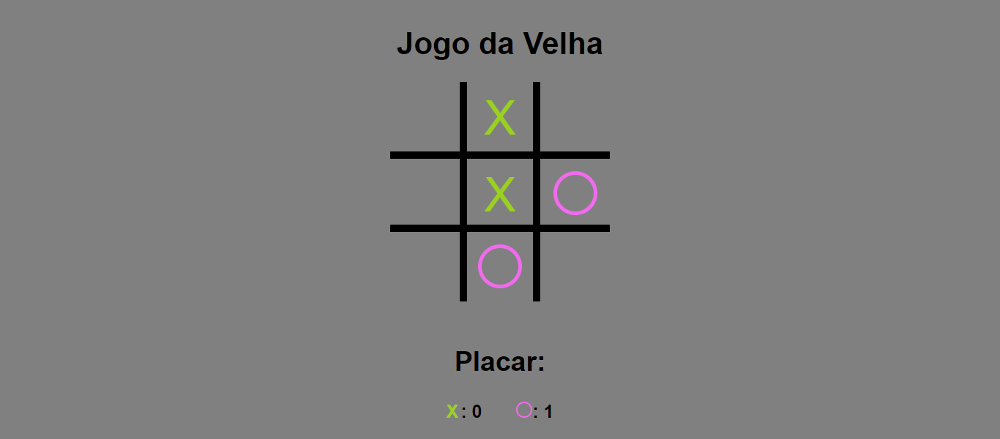

<h1 align="center"> Jogo da velha </h1>

Jogo da velha para passar o tempo!  

  <a href="#-tecnologias">Tecnologias</a>     |    
  <a href="#-projeto">Projeto</a>     |    
  <a href="#memo-licença">Licença</a>

  

 

  
  

##  🚀 Tecnologias

Esse projeto foi desenvolvido com as seguintes tecnologias:

- HTML e CSS
- JavaScript
- Git e Github

##  💻 Projeto

O jogo da velha é um site para passar o tempo!

- [ Visite o projeto online ](https://katia-barbosa-souza.github.io/Jogo-da-velha/)

## : memo : Licença 

Esse projeto está sob a licença MIT.

---

Feito com ♥ pela Desenvolvedora de Front-end Katia Souza